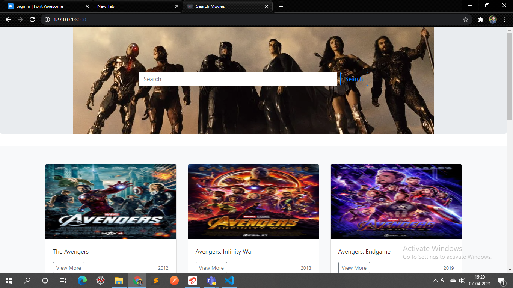
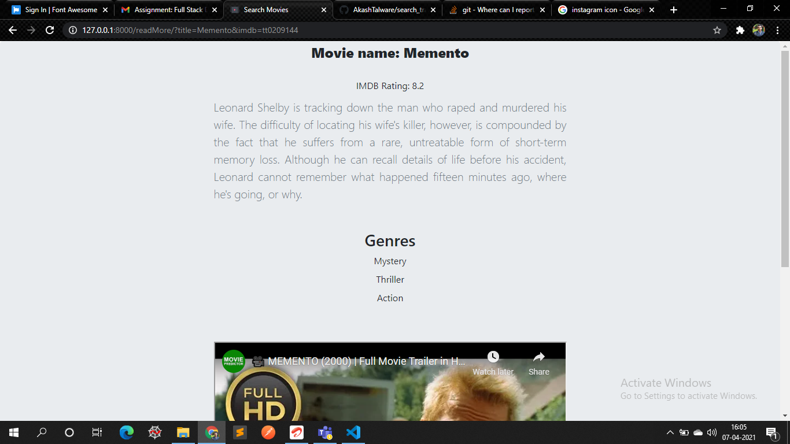
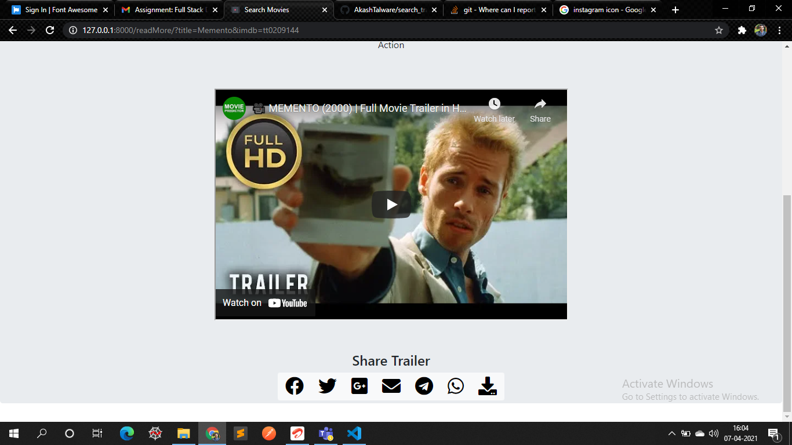

[![LinkedIn][linkedin-shield]][linkedin-url]


<!-- PROJECT LOGO -->
<br />
<p align ="center">
    

  <h3 align ="center">Search Movie Trailers</h3>

  <p align ="center">
    An awesome task which allowed me to understand 3rd party API working and make own WebAPI!
    <br />
    <br />
    <a href="http://ec2-65-2-61-87.ap-south-1.compute.amazonaws.com:8000/">Click here for Demo</a>
    ·
    <a href="https://github.com/AkashTalware">Report Bug</a>
    ·
    <a href="https://github.com/AkashTalware">Request Feature</a>
  </p>
</p>


<!-- TABLE OF CONTENTS -->
## Table of Contents

* [About the Project](#about-the-project)
  * [Built With](#built-with)
* [Getting Started](#getting-started)
  * [Prerequisites](#prerequisites)
  * [Installation](#installation)
* [Usage](#usage)
* [Roadmap](#roadmap)
* [Deployment](#AWS-Deployment)
* [Contributing](#contributing)
* [Contact](#contact)


<!-- ABOUT THE PROJECT -->
## About The Project
<br/><br/>


<br/><br/>

This project will help you in searching any related trailers of a movie which you desire and u will be able to watch, share on social media and download the trailer and also can read the details and description regarding that movie which will be fetched directly from the official IMDb site.

Here's why you should love this assignment:
* I am fluent in Django, python applications, learning about an API added a new feather to my cap of Python frameworks.
* Getting to know Funfacts about API's and creating your own api was fun and insightful, this is the very first implementation of the same.
* I have used IMDb's api using rapid Api (3rd party) for fetching data of movies and Youtube Api for fetching trailer of the related movies and created a seperate own api to aggregate both the api's and work the functionalities.
* You will find good code quality and code standards which can be used to demonstrate to beginners, if not no issues as we are in an agile world. Learning continously.


A list of commonly used resources that I find helpful are listed in the acknowledgements.
<br/><br/>

### Built With
This application is built with love, dedication, coffee and:
* [IMDb](https://rapidapi.com/marketplace)
* [Google cloud api](https://console.cloud.google.com/apis)
* [yotube api](https://developers.google.com/youtube/v3)


<br/><br/>
<!-- GETTING STARTED -->

## Getting Started

To get a local copy up and running follow these simple example steps.
<br/><br/>


### Prerequisites


* python and it's Modules
```sh
python 3+
Django==3.1.7
djangorestframework==3.12.4
requests==2.25.1
Pillow==8.1.2
```
* Other Required libraries can be found in the requirements.txt

<br/><br/>

### Installation

1. Get an API Key at :-

    for IMDb [https://rapidapi.com/marketplace](https://rapidapi.com/marketplace)  
    for Youtube [https://developers.google.com/youtube/v3](https://developers.google.com/youtube/v3)

2. Clone the repository
```
git clone https://github.com/AkashTalware/search_trailers
```

3. Install python packages
```
pip install -r requirements.txt
```

4. Run the application
```
python manage.py runserver
```

<br/><br/>

<!-- USAGE EXAMPLES -->
## Usage

<br/>

* Search the name of movie you want to watch the trailer of. You will get the results and then find the "view more" button to read more about the plot, genre, IMDb rating of the movie.

<br/>

<br/><br/>

* You can also find the trailer on the same page you are reading the movie details. You can watch it and also share it on social media  and download it !!

<br/>

<br/><br/>

For more examples, please refer to the [Documentation](https://github.com/AkashTalware/search_trailers)

<br/><br/>

<!-- ROADMAP -->
## Roadmap

See the [open issues](https://github.com/AkashTalware/search_trailers/issues) for a list of proposed features (and known issues).

<br/><br/>

<!-- DEPLOYMENT -->
## Deployment

Basic Outline of Deploying on AWS would be be following steps:-
* Step 1: Create a Key Pair. ...
* Step 2: Enter the CodeDeploy Console. ...
* Step 3: Launch a Virtual Machine. ...
* Step 4: Name Your Application and Review Your Application Revision. ...
* Step 5: Create a Deployment Group. ...
* Step 6: Create a Service Role. ...
* Step 7: Deploy Your Application. ...
* Step 8: Clean Up Your Instances.


For detailed installation you can go through this [Link](https://aws.amazon.com/getting-started/tutorials/deploy-code-vm/) or  
You can also watch this video for easy understanding of deployment. [video link](https://youtu.be/lH9bwNvaHww)

<br/><br/>

<!-- CONTRIBUTING -->
## Contributing

Contributions are what make the open source community such an amazing place to learn, inspire, and create. Any contributions you make are **greatly appreciated**.

1. Fork the Project
2. Create your Feature Branch 
```
git checkout -b <your_branch_name>
```
3. Commit your Changes 
```
git commit -m "<Commit message>"
```
4. Push to the Branch 
```
git push origin <your_branch_name>
```
5. Open a Pull Request


<br/><br/>

<!-- CONTACT -->
## Contact

Akash Talware - [@akash_talware](https://www.instagram.com/akash_talware/) - My Instagram  
Akash Talware - [akash-t-a79773b4](https://www.linkedin.com/in/akash-t-a79773b4) - My LinkedIn  
Project Link: [https://github.com/AkashTalware/search_trailers](https://github.com/AkashTalware/search_trailers)  

<!-- <br/><br/> -->


<!-- MARKDOWN LINKS & IMAGES -->
<!-- https://www.markdownguide.org/basic-syntax/#reference-style-links -->


[linkedin-shield]: https://img.shields.io/badge/-LinkedIn-black.svg?style=flat-square&logo=linkedin&colorB=555
[linkedin-url]: https://www.linkedin.com/in/akash-t-a79773b4
[how_webpage_looks]: images/how_webpage_looks.png
